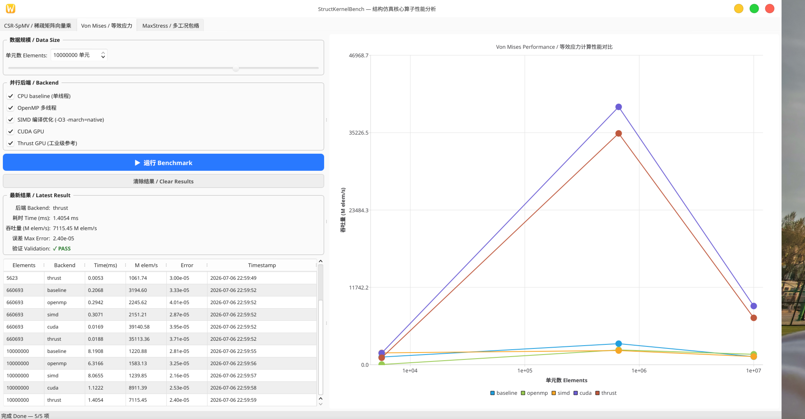
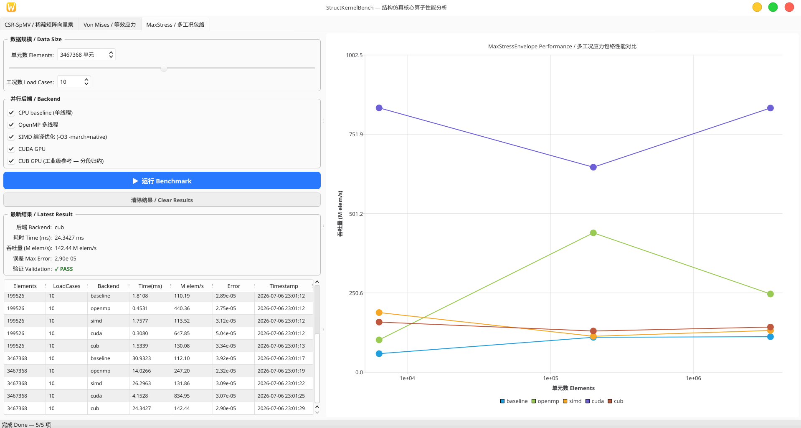

# StructKernelBench

结构仿真核心算子的 CPU/GPU 性能对比实验。从工业 CAE 流程中抽取计算热点，对比手写并行实现与工业级库的性能差距。

**当前状态**：CSR-SpMV、Von Mises、MaxStressEnvelope 三个算子均已完成。

---

## CSR-SpMV

稀疏矩阵向量乘 y = A·x，有限元迭代求解的基础热点。典型的**内存带宽受限**算子。

### 后端

| 后端 | 说明 |
|---|---|
| baseline | CPU 单线程，标准 CSR 循环 |
| OpenMP | `#pragma omp parallel for` 按行并行 |
| SIMD | 编译器自动向量化 (`-O3 -march=native -ffast-math`) |
| CUDA | 手写 kernel，每行一线程 |
| cuSPARSE | NVIDIA 官方库，作为工业级性能上界参考 |

### 对比目的

```
baseline → OpenMP → SIMD → CUDA(手写) → cuSPARSE(工业级)
                                         ↑
                                 手写优化离工业级还有多远？
```


---

## Von Mises

6 分量应力张量 → Von Mises 等效应力标量。有限元后处理的经典热点，典型的**计算密集型**算子。

### 后端

| 后端 | 说明 |
|---|---|
| baseline | CPU 单线程，逐元素计算 |
| OpenMP | `#pragma omp parallel for` 按元素并行 |
| SIMD | 编译器自动向量化 (`-O3 -march=native -ffast-math`) |
| CUDA | 手写 kernel，单元素单线程 |
| Thrust | NVIDIA 并行算法库，`thrust::transform` 工业级参考 |

### 对比目的

```
baseline → OpenMP → SIMD → CUDA(手写) → Thrust(工业级)
                                         ↑
                                 手写优化离 Thrust 还有多远？
```



---

## MaxStressEnvelope

多工况最大应力包络：N 个载荷工况 × M 个单元，逐单元取 Von Mises 应力最大值。典型的**分段归约**模式。

### 后端

| 后端 | 说明 |
|---|---|
| baseline | CPU 单线程，逐元素遍历工况取 max |
| OpenMP | `#pragma omp parallel for` 按元素并行 |
| SIMD | 编译器自动向量化，内层工况循环连续访存 |
| CUDA | 手写融合 kernel，单元素单线程，寄存器内归约 |
| CUB | NVIDIA 底层原语库，`DeviceSegmentedReduce::Max` 工业级分段归约 |

### 对比目的

```
baseline → OpenMP → SIMD → CUDA(手写融合) → CUB(工业级分段归约)
                                             ↑
                                手写融合 kernel 离 CUB 原语还有多远？
```



---

### 项目结构

```
StructKernelBench/
├── CMakeLists.txt
├── common/
│   ├── main.cpp                    # 启动器: QTabWidget 多算子切换
│   └── bench_utils.h / .cpp        # Timer, CsvWriter, median
├── ui/                             # Qt6 界面（所有算子共用）
│   ├── BenchmarkPanel.h / .cpp
│   ├── ResultChartView.h / .cpp
│   ├── SpmvMainWidget.h / .cpp
│   ├── VonMisesMainWidget.h / .cpp
│   └── EnvelopeMainWidget.h / .cpp
├── CSR-SpMV/
│   ├── kernels/                    # 计算实现
│   │   ├── baseline.h / .cpp
│   │   ├── openmp.h / .cpp
│   │   ├── simd.h / .cpp
│   │   ├── cuda_kernel.h / .cu
│   │   └── cusparse_kernel.h / .cu
│   └── spmv_runner.h / .cpp       # 数据生成、计时、验证
├── VonMises/
│   ├── kernels/
│   │   ├── baseline.h / .cpp
│   │   ├── openmp.h / .cpp
│   │   ├── simd.h / .cpp
│   │   ├── cuda_kernel.h / .cu
│   │   └── thrust_kernel.h / .cu
│   └── vonmises_runner.h / .cpp
└── MaxStressEnvelope/
    ├── kernels/
    │   ├── baseline.h / .cpp
    │   ├── openmp.h / .cpp
    │   ├── simd.h / .cpp
    │   ├── cuda_kernel.h / .cu
    │   └── cub_kernel.h / .cu
    └── envelope_runner.h / .cpp
```

### 构建

```bash
mkdir build && cd build
cmake .. -DCMAKE_BUILD_TYPE=Release
cmake --build . -j$(nproc)
./StructKernelBench
```

依赖：**Qt6** (Widgets + Charts)，可选 **CUDA Toolkit** + **OpenMP**（CMake 自动检测）。

### 许可

MIT
