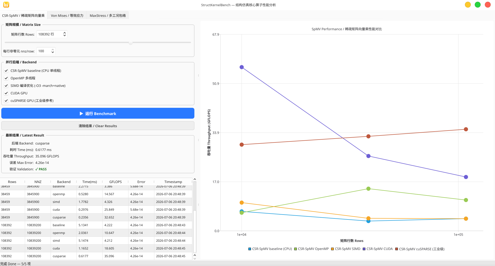

# StructKernelBench

结构仿真核心算子的 CPU/GPU 性能对比实验。从工业 CAE 流程中抽取计算热点，对比手写并行实现与工业级库的性能差距。

**当前状态**：CSR-SpMV 算子已完成，Von Mises / 多工况包络规划中。

---

## CSR-SpMV

稀疏矩阵向量乘 y = A·x，有限元迭代求解的基础热点。典型的**内存带宽受限**算子。

### 后端

| 后端 | 说明 |
|---|---|
| baseline | CPU 单线程，标准 CSR 循环 |
| OpenMP | `#pragma omp parallel for` 按行并行 |
| SIMD | 编译器自动向量化 (`-O3 -march=native -ffast-math`) |
| CUDA | 手写 kernel，每行一线程 |
| cuSPARSE | NVIDIA 官方库，作为工业级性能上界参考 |

### 对比目的

```
baseline → OpenMP → SIMD → CUDA(手写) → cuSPARSE(工业级)
                                         ↑
                                 手写优化离工业级还有多远？
```



### 项目结构

```
StructKernelBench/
├── CMakeLists.txt
├── common/
│   ├── main.cpp                    # 启动器: QTabWidget 多算子切换
│   └── bench_utils.h / .cpp        # Timer, CsvWriter, median
├── CSR-SpMV/
│   ├── kernels/                    # 计算实现
│   │   ├── baseline.h / .cpp
│   │   ├── openmp.h / .cpp
│   │   ├── simd.h / .cpp
│   │   ├── cuda_kernel.h / .cu
│   │   └── cusparse_kernel.h / .cu
│   ├── spmv_runner.h / .cpp       # 数据生成、计时、验证
│   └── ui/                         # Qt6 面板
│       ├── BenchmarkPanel.h / .cpp
│       ├── ResultChartView.h / .cpp
│       └── SpmvMainWidget.h / .cpp
├── VonMises/                       # 计划中
└── MaxStressEnvelope/              # 计划中
```

### 构建

```bash
mkdir build && cd build
cmake .. -DCMAKE_BUILD_TYPE=Release
cmake --build . -j$(nproc)
./StructKernelBench
```

依赖：**Qt6** (Widgets + Charts)，可选 **CUDA Toolkit** + **OpenMP**（CMake 自动检测）。

### 许可

MIT
